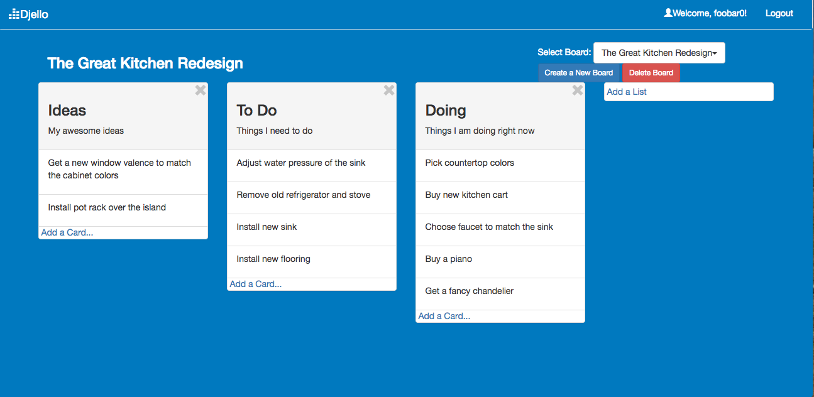

# Djello

Trello clone by David Jiang

Djello helps your team keep track of what needs to be done and makes it easier to assign team members to particular tasks. 

Boards, lists and cards allow users to organize and prioritize projects and teams. Single-page application made with AngularJS, Ruby on Rails and Postgres. Features in-place editing for all fields. 